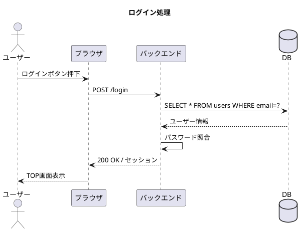
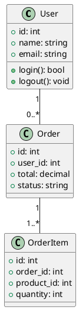

# 🛠️ Phase 5：ツール・実践

> **「知識を手を動かして習得する」フェーズ**
> 現場で使われるツールと、実践的なスキルを身につけます。

---

## なぜツールを使いこなすことが重要か？

設計の知識があっても、**表現・共有する手段**がなければ実務では使えません。上流工程の成果物は「図・ドキュメント」として関係者に伝える必要があります。

```
知識 × ツール = 実務で使える設計スキル
```

---

## 1. UML（統一モデリング言語）

UMLとは、**設計図を書くための共通ルール（記法）**です。世界標準なので、覚えれば誰とでも共通の図で話せます。

### よく使うUML図

| 図の種類 | 用途 | 難易度 |
|---------|------|--------|
| ユースケース図 | ユーザーとシステムの関係 | ★☆☆ |
| クラス図 | クラス・テーブルの構造 | ★★☆ |
| シーケンス図 | 処理の時系列・やりとり | ★★☆ |
| アクティビティ図 | 処理フロー（フローチャート） | ★☆☆ |
| コンポーネント図 | システム構成・依存関係 | ★★★ |

### PlantUMLで図を書いてみよう

PlantUMLはテキストでUML図を書けるツールです。

**シーケンス図の例：**



**クラス図の例：**



---

## 2. 現場で使われるツール一覧

### 設計・モデリング

| ツール | 用途 | 無料？ |
|--------|------|--------|
| **draw.io（diagrams.net）** | フロー図・ER図・構成図 | 無料 |
| **PlantUML** | UML図（テキスト記法） | 無料 |
| **Figma** | ワイヤーフレーム・画面設計 | 無料プランあり |
| **Cacoo** | 図全般 | 一部無料 |
| **Miro** | ホワイトボード・ブレスト | 無料プランあり |
| **Lucidchart** | フロー図・ER図 | 一部無料 |

### ドキュメント管理

| ツール | 用途 |
|--------|------|
| **Confluence** | チームWiki・設計書管理 |
| **Notion** | 仕様書・議事録 |
| **Google Docs** | 共同編集ドキュメント |
| **GitHub Wiki** | 開発者向けドキュメント |

### プロジェクト管理

| ツール | 用途 |
|--------|------|
| **Jira** | タスク管理・スプリント管理 |
| **Backlog** | 日本でよく使われるPJ管理ツール |
| **Trello** | カンバンボード |
| **GitHub Projects** | 開発タスク管理 |

---

## 3. 設計レビューの進め方

設計書が完成したら、レビューで品質を担保します。

### レビューの種類

| 種類 | 説明 |
|------|------|
| ウォークスルー | 作成者が説明し、参加者が質問・指摘する |
| インスペクション | レビュアーが事前に読み込み、会議で議論する |
| ピアレビュー | 同僚エンジニア同士で相互確認 |

### 良いレビューのポイント

```
指摘の仕方：
  ❌「この設計はおかしい」（感情的・否定的）
  ✅「〇〇のケースでは△△の問題が起きそうですが、
     どうお考えですか？」（具体的・建設的）

レビューで確認すること：
  - 要件が全て設計に反映されているか
  - 矛盾・不整合がないか
  - エラーケースが考慮されているか
  - セキュリティ上の問題がないか
  - 実装可能な設計になっているか
```

---

## 4. 実践ガイド：小さく始める設計練習

### 練習1：身近なアプリを分析する（1週間）

普段使っているアプリ（Twitter、メモ帳、カレンダーなど）を逆から分解してみましょう。

```
手順：
1. そのアプリの機能を全て書き出す（要件定義の練習）
2. 画面遷移図を紙に書く（基本設計の練習）
3. どんなテーブルがあるか推測する（DB設計の練習）
4. 主要APIを想像して設計書に書いてみる
```

### 練習2：TODOアプリを設計→実装する（2〜3週間）

```
設計フェーズ：
  1. 要件定義書を書く
     - ユーザーは誰？
     - どんな機能が必要？
     - 非機能要件は？

  2. 基本設計書を書く
     - 画面設計（ワイヤーフレーム）
     - 画面遷移図
     - ER図

  3. 詳細設計書を書く
     - テーブル定義
     - API設計

実装フェーズ：
  4. 設計書通りに実装する
  5. 設計書と実装のズレを振り返る
     → ズレた箇所が設計の甘い部分！
```

### 練習3：オープンソースのコードを読む

GitHubにある実際のOSSプロジェクトを見て、設計を逆から読み解く練習です。

```
おすすめの学習方法：
1. 小規模なOSSを選ぶ（スター1000〜5000程度）
2. READMEを読んで機能を把握する
3. コードを読んでER図・クラス図を書いてみる
4. 元の設計意図を理解する
```

---

## 5. 上流工程エンジニアになるための学習ロードマップ

```
【レベル別 学習ステップ】

Lv.1 基礎知識の習得（1〜3ヶ月）
  □ 各フェーズの役割を理解する（このドキュメント！）
  □ UMLの基本図（ユースケース図・クラス図・シーケンス図）を書けるようにする
  □ draw.io / Figma を使えるようにする

Lv.2 設計を体験する（3〜6ヶ月）
  □ 自分でTODOアプリ等の要件定義〜詳細設計をやってみる
  □ 現職プロジェクトの設計書を読んで理解する
  □ 設計書のレビューに参加してみる

Lv.3 実務で貢献する（6ヶ月〜）
  □ 小さな機能追加の設計を担当する
  □ 設計書を自分で作ってレビューを受ける
  □ 要件定義のヒアリングに同席・補助する

Lv.4 リードできるようになる（1〜2年）
  □ 機能単位の要件定義〜基本設計を主担当できる
  □ 設計レビューでレビュアー側に回れる
  □ アーキテクチャ提案ができる
```

---

## 6. おすすめ書籍・学習リソース

### 書籍

| タイトル | 対象 | 難易度 |
|--------|------|--------|
| 「はじめてのシステム設計」 | 設計入門 | ★☆☆ |
| 「オブジェクト指向設計実践ガイド」 | OO設計 | ★★☆ |
| 「Clean Architecture」 | アーキテクチャ | ★★★ |
| 「ドメイン駆動設計入門」 | DDD | ★★☆ |
| 「データベース設計徹底指南書」 | DB設計 | ★★☆ |
| 「UML モデリングの本質」 | UML | ★★☆ |

### オンライン学習

- **Qiita / Zenn**：日本語の技術記事が豊富
- **IPA 情報処理推進機構**：基本情報・応用情報技術者試験の教材
- **YouTube**：「システム設計入門」「アーキテクチャ設計」で検索
- **GitHub**：実際のOSSコードで設計を学ぶ

### 資格

| 資格 | 内容 |
|------|------|
| 基本情報技術者試験 | IT基礎全般（設計の基礎知識も含む） |
| 応用情報技術者試験 | 設計・管理・アーキテクチャ全般 |
| ITストラテジスト試験 | 要件定義・上流工程に特化 |
| システムアーキテクト試験 | 設計・アーキテクチャに特化 |

---

## まとめ：上流工程エンジニアへの第一歩

1. **まず全体を知る** → このドキュメントで達成！
2. **小さく体験する** → 身近なアプリを設計してみる
3. **現場で実践する** → 今の仕事で設計書を書く機会を探す
4. **フィードバックをもらう** → レビューを積極的に受ける

> 🌟 **コーディングスキルは上流工程の大きな武器！**
> 「この設計が実装可能かどうか」を判断できる上流工程エンジニアは
> 非常に価値が高いです。今持っているスキルを活かして、
> 一歩ずつ上流工程へ進んでいきましょう！

---

👈 [00_overview（全体マップ）に戻る](../00_overview/README.md)
